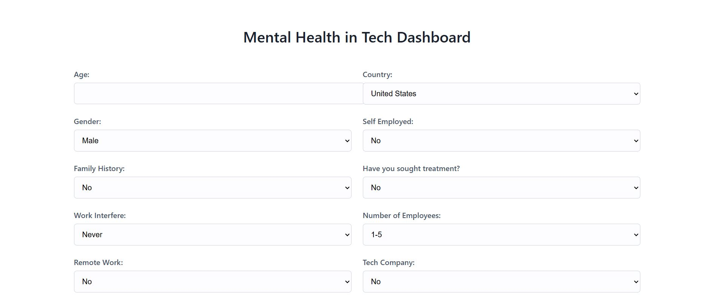
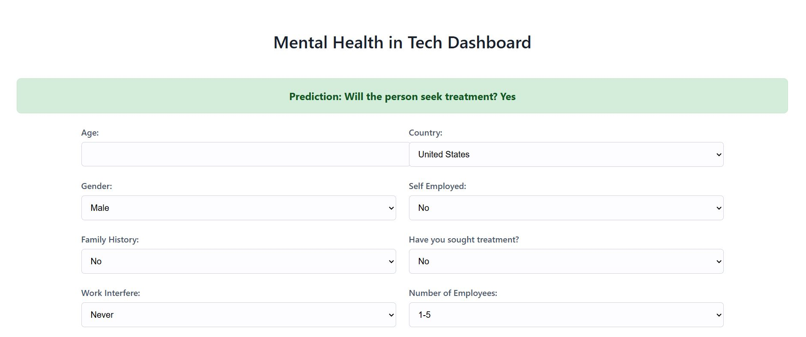
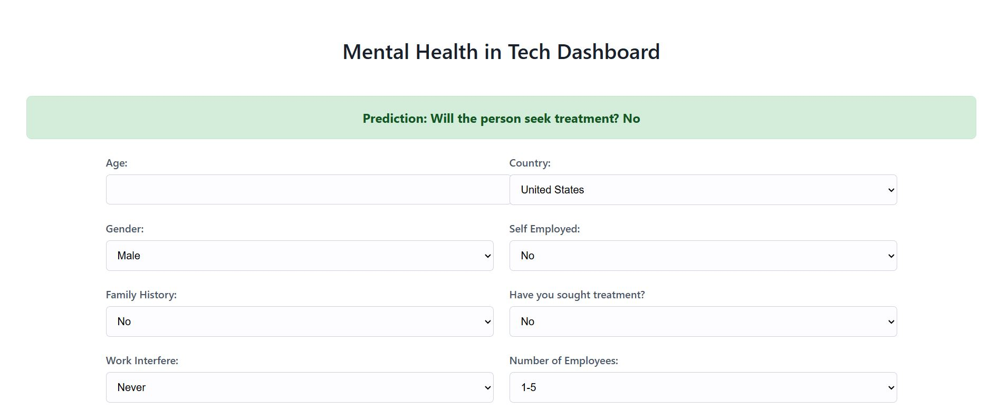

**Mental Health Treatment Prediction for the Tech Industry**

This project is an end-to-end machine learning application that predicts whether an employee in the tech industry is likely to seek treatment for a mental health condition. The project includes a full data science pipeline from data cleaning and analysis to model training and deployment as a live web application.

Live Application Link: https://mental-health-treatment-in-tech-industry.onrender.com

**Table of Contents**
- Project Overview

- Features

- Tech Stack

- Project Structure

- Setup and Local Installation

- Usage

- Deployment

- File Descriptions

**Project Overview**

Mental health is a critical but often overlooked issue in the fast-paced tech industry. This project aims to leverage data to build a predictive model that can identify individuals who might need mental health support. A survey dataset containing various work-related and personal attributes is used to train a RandomForestClassifier model. The final model is deployed as a user-friendly Flask web application where users can input their details and receive an instant prediction.

**Features**

- **Data Cleaning & Preprocessing**: Handles missing values, corrects data types, and standardizes categorical data.

- **Exploratory Data Analysis (EDA)**: Uncovers insights and relationships between features using visualizations.

- **Feature Engineering**: Creates new features (like Age Groups) and encodes categorical data for model consumption.

- **Model Training & Tuning**: Compares multiple classification algorithms and uses GridSearchCV for hyperparameter optimization to select the best-performing model.

- **Database Integration**: Uses MongoDB Atlas to store and retrieve the processed dataset, ensuring a scalable data pipeline.

- **Interactive Web UI**: A clean, full-screen dashboard built with Flask and HTML/CSS allows for easy user interaction.

- **API Endpoint**: Includes a /predict API endpoint for making predictions programmatically.

- **Cloud Deployment**: The entire application is deployed on Render for public access.

**Tech Stack**

- **Backend**: Python, Flask

- **Machine Learning**: Scikit-learn, CatBoost, XGBoost, Pandas, NumPy

- **Database**: MongoDB Atlas

- **Deployment**: Render, Gunicorn

- **Data Visualization**: Matplotlib, Seaborn

- **Development**: Jupyter Notebook, Git & GitHub

**Project Structure**

      Mini Hackathon!/
      ├── data/
      │   ├── raw/
      │   │   └── survey.csv
      │   └── processed/
      │       └── processed_data.csv
      ├── models/
      │   └── trained_model.pkl
      ├── notebooks/
      │   ├── 1_data_cleaning.ipynb
      │   ├── 2_exploratory_analysis.ipynb
      │   ├── 3_feature_engineering.ipynb
      │   └── 4_model_training.ipynb
      ├── src/
      │   ├── __init__.py
      │   ├── app.py                      # Main Flask application
      │   ├── data/
      │   │   └── preprocess.py
      │   ├── models/
      │   │   ├── predict.py
      │   │   └── train.py
      │   └── utils/
      │       └── helpers.py
      ├── templates/
      │   └── form.html
      ├── requirements.txt
      └── README.md

**Setup and Local Installation**
To run this project on your local machine, follow these steps:
1. **Clone the Repository**
git clone [https://github.com/shubhamverma0298/Mental-health-treatment-in-tech-industry.git](https://github.com/shubhamverma0298/Mental-health-treatment-in-tech-industry.git)
cd Mental-health-treatment-in-tech-industry

2. **Create a Virtual Environment**
It's recommended to create a virtual environment to manage dependencies.
python -m venv venv
source venv/bin/activate  # On Windows, use `venv\Scripts\activate`

3. **Install Dependencies**
Install all the required packages from the requirements.txt file.
pip install -r requirements.txt

4. **Set up MongoDB Atlas (Optional)**
The helpers.py script is configured to use a local CSV for data upload if the MongoDB collection is empty. However, to run the full pipeline, you can:
Create a free cluster on MongoDB Atlas.
Create a new database (e.g., MiniHackathonDB) and a collection (e.g., ProcessedData).
Update the mongo_uri in src/utils/helpers.py with your own connection string.

5. **Train the Model**
Run the training script from the root directory. This will generate the trained_model.pkl file in the models folder.
python -m src.models.train

6. **Run the Flask Application**
Start the Flask development server.
python src/app.py

**Images**:-->>

- **Yes Prediction**

- **No Prediction**

